# Adversarial Robustness for Parcel Tampering Detection - TAMPAR

This repo was forked from repo present on [project page](https://a-nau.github.io/tampar/) and enhanced to perform title changes. refer the repository link for orginal TAMPAR.

**This fork extends the original TAMPAR system** with two major enhancements developed by Group 7:
1. **Extension A — Adversarial Robustness:** FGSM & PGD attack generation + adversarial training
2. **Extension B — Enhanced Detection:** SimSaC fine-tuning via direct change map supervision + XGBoost classification

<p align="center">
    
    <br>
    <span style="font-size: small">
        <b>Figure 1:</b>
        We detect tampering by comparing the full parcel texture from a database (a) with the
        viewpoint-invariant parcel side surfaces of a single image by exploiting parcel corner point
        predictions (b). Appearance change detection is performed for each pair of matching parcel
        side surfaces to identify tampering (c). © IEEE 2024.
    </span>
</p>

---

## Table of Contents

- [Group 7 Enhancements](#group-7-enhancements)
  - [Pipeline Overview](#pipeline-overview)
  - [Key Results](#key-results)
  - [Extension A: Adversarial Robustness](#extension-a-adversarial-robustness)
  - [Extension B: SimSaC Fine-Tuning & Enhanced Classification](#extension-b-simsac-fine-tuning--enhanced-classification)
  - [Running the Extensions](#running-the-extensions)
- [Original TAMPAR Usage](#original-tampar-usage)
  - [Setup](#setup)
  - [Keypoint Detection](#keypoint-detection)
  - [Predict Tampering](#predict-tampering)
- [TAMPAR Dataset](#tampar-dataset)
- [Citation](#citation)
- [Affiliations](#affiliations)
- [Credits](#credits)

---

## Group 7 Enhancements

### Pipeline Overview

The original TAMPAR pipeline uses Mask R-CNN for keypoint detection, UV map generation for surface normalisation, and SimSaC + a decision tree for tampering classification. This extension adds four new stages while keeping three original stages unchanged:

<p align="center">
    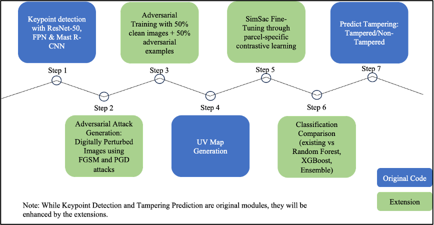
    <br>
    <span style="font-size: small">
        <b>Figure 2:</b> Pipeline overview illustrating the original code (grey) and proposed extensions (coloured) in the enhanced pipeline.
    </span>
</p>

| Step | Type | Description |
|---|---|---|
| 1 | ✅ Original | Keypoint detection — Mask R-CNN with ResNet-50 & FPN |
| 2 | 🆕 Extension A | FGSM & PGD adversarial attack generation |
| 3 | 🆕 Extension A | Adversarial training (50% clean / 50% adversarial batches) |
| 4 | ✅ Original | UV Map generation (also applied to adversarial images) |
| 5 | 🆕 Extension B | SimSaC fine-tuning with direct change map supervision |
| 6 | 🆕 Extension B | Random Forest, XGBoost & ensemble classification |
| 7 | ✅ Original | Final tampering prediction (now using best classifier) |

> **Note:** Keypoint detection proved robust to adversarial attacks (97.89% clean → 97.70% adversarial), so adversarial retraining of the keypoint detector was not required.

---

### Key Results

#### Baseline Detection Results (Clean Images, Original Pipeline)

<p align="center">
    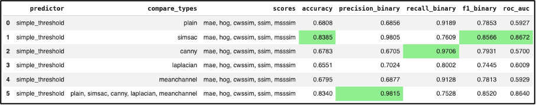
    <br>
    <span style="font-size: small">
        <b>Table 2:</b> Baseline Simple Threshold Tampering Detection results from the original implementation.
    </span>
</p>

#### Keypoint Detection — Robust Under Attack

<p align="center">
    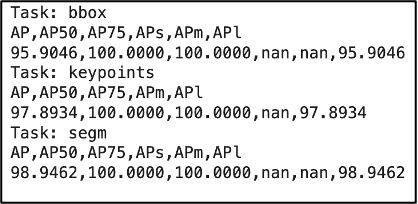
    <br>
    <span style="font-size: small">
        <b>Table 4:</b> Baseline Keypoint Detection results (left) and Keypoint Detection results on adversarial images (right). Robustness confirmed — no retraining needed.
    </span>
</p>

#### Enhanced Pipeline — Classifier Comparison

<p align="center">
    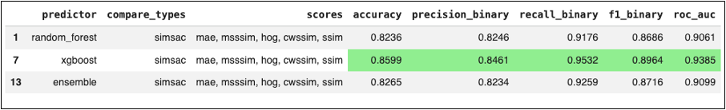
    <br>
    <span style="font-size: small">
        <b>Table 6:</b> Performance comparison of classifiers over SimSAC fine-tuned features. Top: clean images. Bottom: adversarial images. XGBoost yields the best result across both conditions.
    </span>
</p>

**Summary of gains with fine-tuned SimSaC + XGBoost:**

| Condition | Metric | Baseline | Enhanced | Improvement |
|---|---|---|---|---|
| Clean images | Accuracy | 83.85% | **87.00%** | +3.15 pp |
| Clean images | ROC-AUC | 0.8672 | **0.9436** | +0.076 |
| Adversarial | Accuracy | 72.21% | **85.99%** | +13.78 pp |
| Adversarial | ROC-AUC | 0.7705 | **0.9385** | +0.168 |
| Adversarial | Recall | 59.22% | **95.32%** | +36.10 pp |

---

### Extension A: Adversarial Robustness

#### What Was Done

- Implemented **FGSM** (Fast Gradient Sign Method) and **PGD** (Projected Gradient Descent) attacks with perturbation budget ε = 10
- Generated **439 adversarial images per attack type** (PGD and FGSM) across test and validation splits
- Established the **first adversarial benchmark** for parcel tampering detection
- Performed adversarial training using 50% clean + 50% adversarial mixed batches

#### Attack Visualisations

Adversarial perturbations are clearly visible when viewed through image homogenization methods:

<p align="center">
    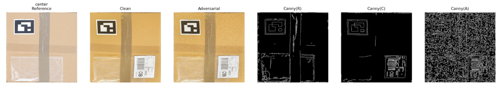
    <br>
    <span style="font-size: small">
        <b>Figure 3:</b> Center surface of a <em>tampered</em> parcel (label applied). Reference (R), clean (C), and adversarial (A) versions viewed through Canny edge homogenization.
    </span>
</p>

<p align="center">
    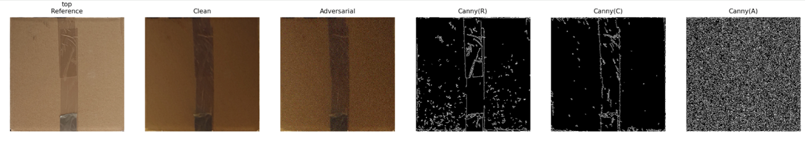
    <br>
    <span style="font-size: small">
        <b>Figure 4:</b> Center surface of a <em>clean</em> parcel. Reference (R), clean (C), and adversarial (A) versions viewed through Canny edge homogenization.
    </span>
</p>

<p align="center">
    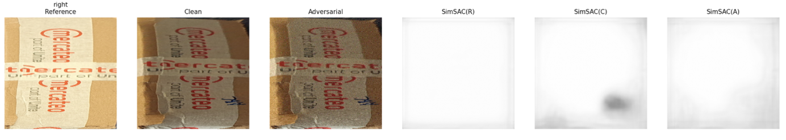
    <br>
    <span style="font-size: small">
        <b>Figure 5:</b> Right surface of a <em>tampered</em> parcel (writing). Reference (R), clean (C), and adversarial (A) versions viewed through SimSAC homogenization.
    </span>
</p>

<p align="center">
    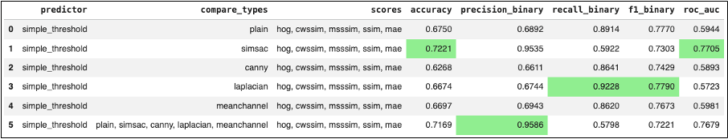
    <br>
    <span style="font-size: small">
        <b>Table 3:</b> Simple Threshold Tampering Detection results on adversarial images — accuracy drops ~10 pp from ~82% to ~72%.
    </span>
</p>

#### Running Adversarial Attack Generation

```shell
# Generate FGSM and PGD adversarial examples
python src/tools/generate_adversarial.py --attack fgsm --epsilon 10
python src/tools/generate_adversarial.py --attack pgd --epsilon 10 --iterations 40
```

#### Running Adversarial Training

```shell
# Train with mixed clean + adversarial batches (50/50 split)
python src/tools/adversarial_train.py --clean-ratio 0.5 --attack pgd --epsilon 10
```

---

### Extension B: SimSaC Fine-Tuning & Enhanced Classification

#### Contrastive Pair Strategy

SimSaC was fine-tuned using surface-level positive/negative pairs:

| Pair Type | Label | Count |
|---|---|---|
| Reference vs uvmap_pred (clean) | Positive | 361 |
| Reference vs uvmap_gt (clean) | Positive | 369 |
| Reference vs Augmented Reference | Positive | 114 |
| Reference vs Adversarial (clean) | Positive | 695 |
| **Total Positive** | | **1,539** |
| Reference vs Tampered uvmap_gt | Negative | 561 |
| Reference vs Tampered uvmap_pred | Negative | 551 |
| Reference vs Adversarial (tampered) | Negative | 1,066 |
| **Total Negative** | | **2,178** |
| **Grand Total** | | **3,717** |

#### Phase 1: Contrastive Loss on Projection Head

Training and validation loss converge smoothly within 20 epochs:

<p align="center">
    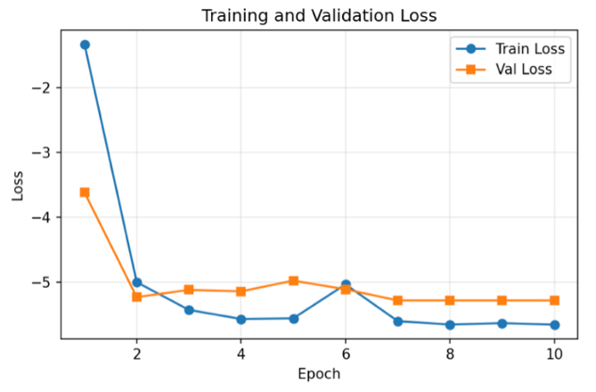
    <br>
    <span style="font-size: small">
        <b>Figure 6:</b> SimSAC fine-tuning training and validation loss for contrastive learning (Phase 1). Both curves converge with minimal gap, indicating no overfitting.
    </span>
</p>

#### Embedding Separation: Baseline vs Fine-Tuned

<p align="center">
    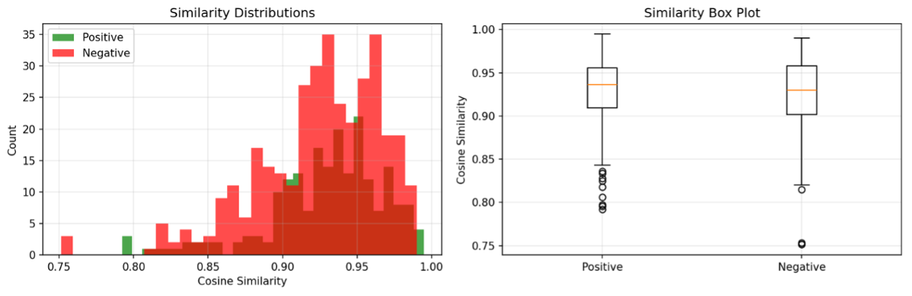
    <br>
    <span style="font-size: small">
        <b>Figure 7:</b> Similarity distributions for surface-wise pairs with the <em>baseline pre-trained</em> SimSAC model. Significant overlap between positive and negative pairs on adversarial images.
    </span>
</p>

<p align="center">
    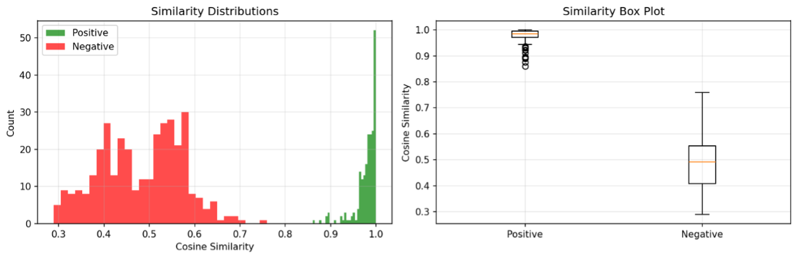
    <br>
    <span style="font-size: small">
        <b>Figure 8:</b> Similarity distributions with the <em>fine-tuned</em> SimSAC model. Positive pairs cluster near 1.0 (median ~0.98); negative pairs spread 0.30–0.70 (median ~0.55).
    </span>
</p>

#### Phase 2: Direct Change Map Supervision

Phase 1's contrastive embeddings are **discarded at inference time** — SimSAC uses per-pixel change maps, not embedding similarity scores. To fix this, Phase 2 directly optimises the change maps:

```
Loss = (1 - 2 × label) × mean_change_map
```

where `label = 1` for tampered pairs and `0` for clean pairs. Both the VGG feature pyramid and decoder layers are unfrozen, with the backbone trained at a lower learning rate.

<p align="center">
    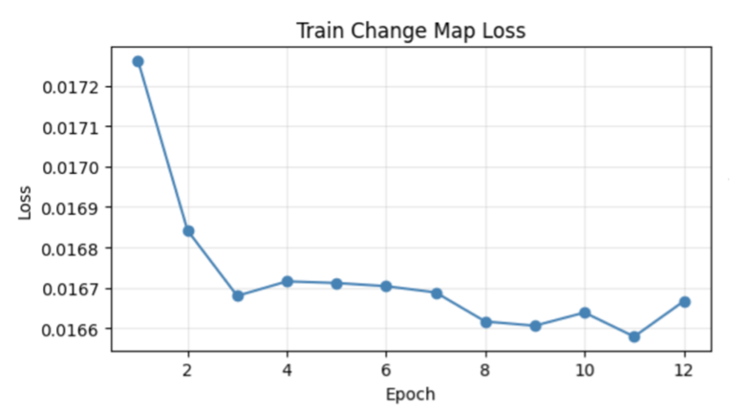
    <br>
    <span style="font-size: small">
        <b>Figure 9:</b> Training loss curve for direct change map fine-tuning of SimSAC over 12 epochs. Consistent downward trend confirms stable learning.
    </span>
</p>

#### Qualitative Results on Adversarial Examples

<p align="center">
    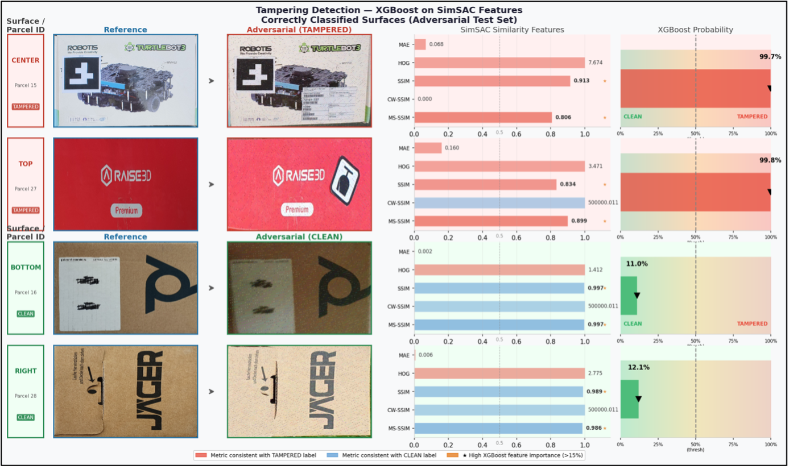
    <br>
    <span style="font-size: small">
        <b>Figure 10:</b> Tampering detection using XGBoost on SimSaC features — representative classification results on the adversarial test set. Tampered parcels (Parcel 15, Parcel 27) detected with 99.8% confidence; clean parcels (Parcel 23, Parcel 16) correctly rejected with 9.9% and 11.0% tampering probability.
    </span>
</p>

#### Running SimSaC Fine-Tuning

```shell
# Phase 1: Projection head only (frozen backbone)
python src/tools/finetune_simsac.py --phase 1 --epochs 20 --batch-size 8

# Phase 2: Full fine-tuning with direct change map loss
python src/tools/finetune_simsac.py --phase 2 --epochs 12 --batch-size 8 --backbone-lr 1e-5
```

#### Running Enhanced Classification

```shell
# Compute similarity scores using fine-tuned SimSaC
python src/tools/compute_similarity_scores.py --weights src/simsac/weight/finetuned_simsac.pth

# Train and evaluate enhanced classifiers
python src/tools/predict_tampering_enhanced.py --classifier xgboost
python src/tools/predict_tampering_enhanced.py --classifier random_forest
python src/tools/predict_tampering_enhanced.py --classifier ensemble
```

**Classifier hyperparameters:**

| Classifier | Config |
|---|---|
| Random Forest | 100 estimators, max depth = 8 |
| XGBoost | 100 estimators, max depth = 5, lr = 0.1 |
| Soft Voting Ensemble | Decision Tree + Random Forest + XGBoost |

Hyperparameter tuning via grid search:
- **Random Forest:** estimators ∈ {100, 200, 300}, max depth ∈ {None, 5, 10}
- **XGBoost:** estimators ∈ {200, 300}, max depth ∈ {3, 6}, lr ∈ {0.05, 0.1}

---

### Running the Extensions

#### Environment

| Platform | Use |
|---|---|
| GitHub Codespaces (2-core, 8 GB RAM) | Development & debugging |
| Google Colab T4 High-RAM | Feature extraction, classifier training |
| Google Colab A100 | Adversarial image generation, SimSaC fine-tuning |

#### Full Enhanced Pipeline (End-to-End)

```shell
# Step 1: Keypoint detection (original)
python src/tools/train_maskrcnn.py --config-file ./src/maskrcnn/configs/test.yaml --gpus "0"

# Step 2: Generate adversarial examples
python src/tools/generate_adversarial.py --attack fgsm --epsilon 10
python src/tools/generate_adversarial.py --attack pgd --epsilon 10

# Step 4: UV Map generation (original — also runs on adversarial images)
python src/tools/generate_uv_maps.py

# Step 5a: SimSaC fine-tuning Phase 1
python src/tools/finetune_simsac.py --phase 1 --epochs 20

# Step 5b: SimSaC fine-tuning Phase 2 (direct change map loss)
python src/tools/finetune_simsac.py --phase 2 --epochs 12

# Step 6: Compute similarity scores with fine-tuned model
python src/tools/compute_similarity_scores.py --weights src/simsac/weight/finetuned_simsac.pth

# Step 7: Predict tampering with XGBoost
python src/tools/predict_tampering_enhanced.py --classifier xgboost
```

#### Additional Weights & Benchmark

- Fine-tuned SimSaC weights — *(link to be added after release)*
- Adversarial benchmark dataset (439 FGSM + 439 PGD images) — *(link to be added after release)*

---

## Original TAMPAR Usage

### Setup

We highly recommend using the provided Devcontainer to make the usage as easy as possible:

- Install [Docker](https://www.docker.com/) and [VS Code](https://code.visualstudio.com/)
- Install VS Code Devcontainer extension `ms-vscode-remote.remote-containers`
- Clone the repository
  ```shell
  git clone https://github.com/r-sharma/tampar.git
  ```
- Press `F1` (or `CTRL + SHIFT + P`) and select `Dev Containers: Rebuild and Reopen Container`
- Go to `Run and Debug (CTRL + SHIFT + D)` and press the run button, alternatively press `F5`

Afterwards:

- Download the pre-trained SimSaC weights from [here](https://drive.google.com/drive/folders/119FRNCyrIXxxYrZi-_kbGrGFiQ1MSkAG) and paste them into `src/simsac/weight`
- Download the pre-trained keypoint detection weights from [here](https://drive.google.com/file/d/1TC8pC-iDBGSqkwEs7dtcY-ZKdUorm0Fz)

### Keypoint Detection

To run a training on the 5 [example images](data/tampar_sample/validation/) run:

```shell
python src/tools/train_maskrcnn.py --config-file ./src/maskrcnn/configs/test.yaml --gpus "0" --num-gpus 1 --num-machines 1
```

- To add your own dataset, register it in [register_datasets.py](src/maskrcnn/data/register_datasets.py)
- To check results qualitatively use [detectron_qualitative_evaluation.ipynb](src/notebooks/detectron_qualitative_evaluation.ipynb)

### Predict Tampering

We first need to compute all relevant similarity scores:

```shell
python src/tools/compute_similarity_scores.py
```

Afterwards, we can train the decision tree and predict tampering using:

```shell
python src/tools/predict_tampering.py
```

> **Note:** This will run only on the sample data from [data/tampar_sample/](data/tampar_sample/).

---

## TAMPAR Dataset

You can download the dataset from [Zenodo](https://zenodo.org/records/10057090).

- ~1,300 high-resolution images (4032×3024 pixels)
- 30 unique parcel IDs across train / validation / test splits
- Annotations: bounding boxes, segmentation masks, 8 keypoints per parcel, binary tampering labels
- Format: COCO annotation standard

<p align="center">
    
    <br>
    <span style="font-size: small">
      <b>Figure:</b>
        Visual samples from TAMPAR.
        Check our <a href="https://a-nau.github.io/tampar/">project website</a> for more.
    </span>
</p>

---

## Citation

If you use the code of the original TAMPAR paper for scientific research, please consider citing:

```bibtex
@inproceedings{naumannTAMPAR2024,
    author    = {Naumann, Alexander and Hertlein, Felix and D\"orr, Laura and Furmans, Kai},
    title     = {TAMPAR: Visual Tampering Detection for Parcels Logistics in Postal Supply Chains},
    booktitle = {Proceedings of the IEEE/CVF Winter Conference on Applications of Computer Vision},
    month     = {January},
    year      = {2024},
    note      = {to appear in}
}
```

If you use the adversarial benchmark or extensions mentioned above from this fork, please also cite:

```bibtex
@misc{group7TAMPAR2025,
    author    = {Mittal, Nishith Mohan and Sharma, Rakesh and Rakesh, Pallav Krishna and Maringanti, Yashwanth},
    title     = {Adversarial Robustness and Enhanced Detection for Parcel Tampering},
    year      = {2025},
    note      = {Course project extending TAMPAR (WACV 2024)}
}
```

---

## Affiliations

<p align="center">
    
</p>

---

## Credits

- We use [SimSaC](src/simsac/readme.md) inference code. Licensed under [GPL-3.0](https://github.com/SAMMiCA/SimSaC/blob/main/LICENSE) which applies to folder [src/simsac](src/simsac/)
- The [Mask R-CNN](src/maskrcnn/) is borrowed from [CubeRefine R-CNN](https://github.com/a-nau/CubeRefine-R-CNN) (See [License](https://github.com/a-nau/CubeRefine-R-CNN/blob/main/LICENSE.md)) and [this implementation](https://github.com/a-nau/image-selection-and-cnn-training) ([MIT License](https://github.com/a-nau/image-selection-and-cnn-training/blob/main/LICENSE)), which applies to folder [src/maskrcnn](src/maskrcnn/)
- Adversarial attack references: [Madry et al., 2019 — PGD](http://arxiv.org/abs/1706.06083), [Goodfellow et al., 2015 — FGSM](https://arxiv.org/abs/1412.6572)
- Contrastive learning reference: [Chen et al., 2020 — SimCLR](http://arxiv.org/abs/2002.05709)

Unless otherwise stated, this repo is distributed under [MIT License](LICENSE).
